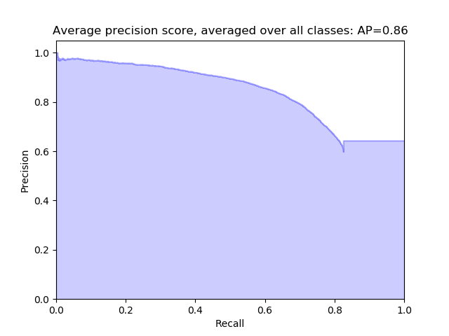

# AirHorseIdentification

- processing system which detects and identifies the horses in aerial images recorded by a drone
- Pre-processed the large tar type Aerial image {Approx 10TB data} and created a clean trainable dataset 
- Successfully detected and identified individuals from 145 breeds with mAP score of 86% for IOU 0.5

